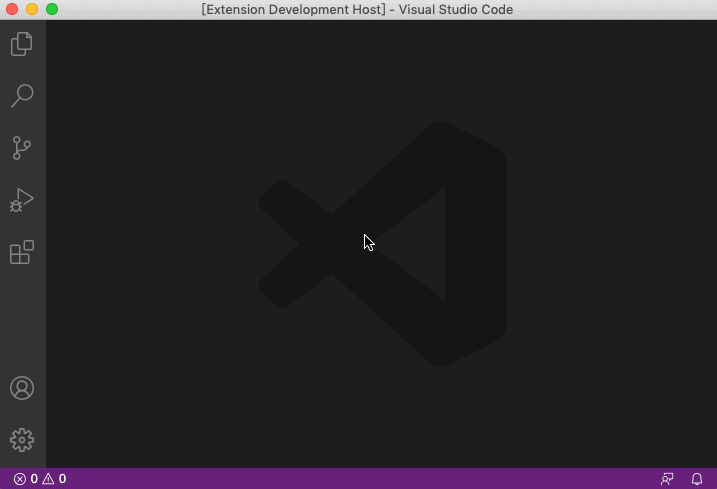

# VSCode 股票小工具

## 简介

一款可以查看 `实时股价`、`盈亏情况`、`盈亏警告` 的 VSCode 插件。



## 说明

当运行监控命令后底部 `statusBar` 会展示类似如下数据：

```
💰 28.57 「500ETF」7.44 0.26% 34.23% 28.57 「300ETF」4.81 -0.37%
```

* 今日收益情况: 28.57元
* 500ETF 现价 7.44, 今日盈亏 0.26%, 持仓盈亏 34.23%, 今日收益 28.57
* 300ETF 现价 4.81, 今日盈亏 -0.37%

## 配置

### 配置方法

在用户配置中设置需要监控的数据，具体方法 `cmd + shift + p` 输入 Setting 并选择对应数据。

### 配置示例

```javascript
{
  "stock-for-vscode": {
    // 用于设置股票监听的接口提供商
    // 默认值 sina, 可选值 string: "sina" | "netease" | "tencent" | "xueqiu"
    "api": "netease",

    // 接口刷新间隔时间(秒)，太过频繁可能导致接口被限制
    // 默认值 10，可选值 number。
    "interval": 10,

    // 股票上涨颜色
    // 默认值 #ffffff，可选值 string: rgb。
    "up_color": "#ffffff",

    // 股票下跌颜色
    // 默认值 #000000，可选值 string: rgb。
    "down_color": "#000000",

    // 上涨百分比警告
    // 默认值 0.1，可选值 number。
    "up_percent": 0.1, 

    // 下跌百分比警告
    // 默认值 0.1，可选值 number。
    "down_percent": -0.08, 

    // 需要监控的股票组
    // 可选值 Stock: { name: string, code: string, unit: number, volume: number }
    "stocks": [
      {
        // 需要监控的股票名称
        // 可选值: string
        "name": "500ETF",

        // 需要监控的股票代码，格式为交易所常量+股票代码
        // 上交所 SH、深交所 SZ、港交所 HK、美交所 US
        // 可选值: string。
        "code": "SH510500",

        // 需要监控的股票成本价格，插件会监控并计算实时收益情况
        // 可选值: number。
        "unit": 5.545,

        // 需要监控的股票持仓数量，插件会监控并计算实时收益情况
        // 可选值: number。
        "volume": 1500
      },
      {
        "name": "300ETF",
        "code": "SH510300",
        "unit": 0,
        "volume": 0
      },
      {
        "name": "芯片ETF",
        "code": "SH512760",
        "unit": 2.319,
        "volume": 7000
      }
    ]
  }
}
```

## 一起成长

> 韭菜小猪也有暴富梦~

* 在困惑的城市里总少不了并肩同行的 伙伴 让我们一起成长。
* 如果您想让更多人看到文章可以点个 点赞。
* 如果您想激励小二可以到 Github 给个 小星星。
